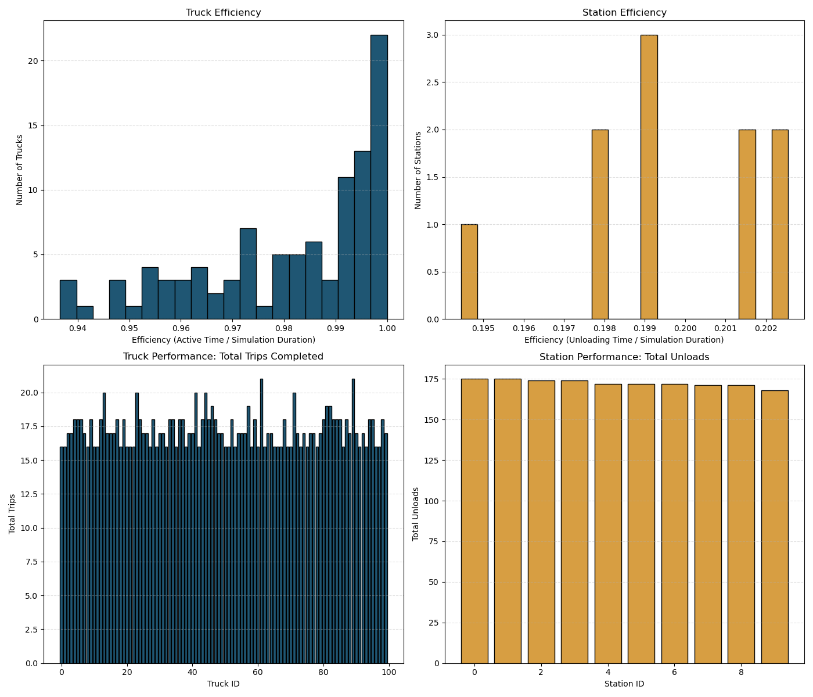

# Sample Simulation Results & Analysis Report

This document presents a sample run of the Vast Mining Simulator, showcasing simulation output, efficiency metrics, and visual analysis.

---

## Configuration

**Simulation Parameters:**
- Trucks: 100
- Stations: 10
- Duration: 72 hours (4320 minutes)
- Random Seed: Default (`RANDOM_SEED`)

The simulation was run using the following command:
```bash
./simulator_main 100 10 4320
```

---

## Metrics Summary

For each truck and station, the following metrics were computed:

Console output:

```
Simulation completed in 87 ms

=== Simulation Summary ===
Simulation Time: 4320 minutes
Trucks: 100
Stations: 10
Average Truck Utilization: 97.61%
Average Station Utilization: 19.95%
```

`metrics.<params>.json`:

```
{
  "simulation_duration": 4320,
  "stations": [
    {
      "avg_queueing_time": 0.0,
      "id": 0,
      "idle_time": 3445,
      "queueing_time": 0,
      "queues_completed": 0,
      "throughput": 175,
      "unloading_time": 875,
      "utilization": 20.25462962962963
    },
    ...
  ]
   "trucks": [
    {
      "avg_queueing_time": 0.0,
      "avg_trip_time": 269.1875,
      "id": 0,
      "idle_time": 13,
      "mines_completed": 16,
      "mining_time": 3297,
      "queueing_time": 0,
      "queues_completed": 0,
      "trips_completed": 16,
      "utilization": 99.69907407407408
    },
    ...
  ]
}
```

`events.<params>.json`:

```
{
  "simulation_duration": 4320
  "events": [
    {
      "end_time": 212,
      "start_time": 0,
      "truck_id": 0,
      "type": "Mine"
    },
    ...
  ]
}
```

---

## Visualization

The following plots were generated using the script:
```bash
python scripts/plot_report.py --events build/events.<params>.json
```

**Metrics Visualized:**
- Truck Efficiency (active time / sim time)
- Station Efficiency (unloading time / sim time)
- Truck Utilization
- Station Utilization

### Sample Output



---
